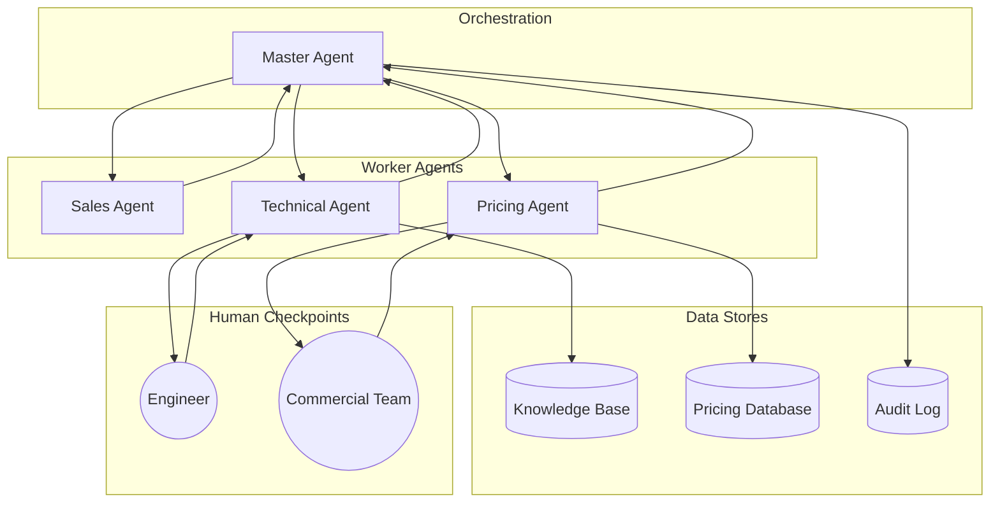
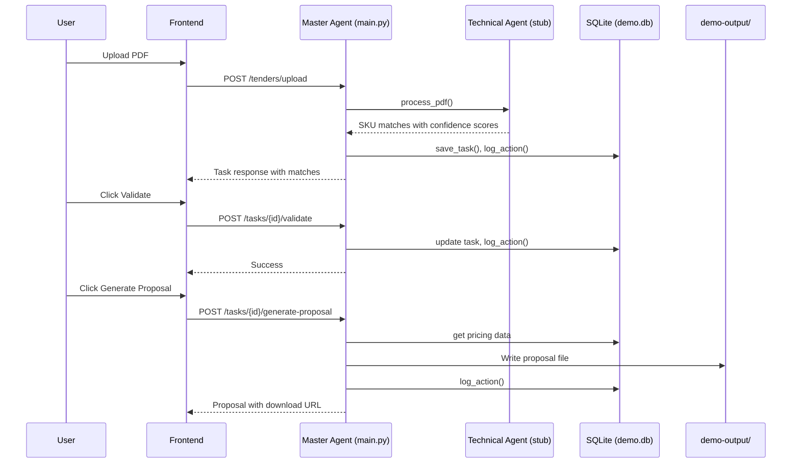

# Context: SpecMatch AI Hub

This document provides the complete technical context for the SpecMatch AI Hub codebase. It covers architecture, data flow, file responsibilities, and the project structure.

---

## 1. Project Identity

| Key | Value |
|-----|-------|
| Name | SpecMatch AI Hub |
| Version | 1.0.0 |
| Type | Agentic AI Orchestration Platform |
| Goal | Automate industrial RFP responses using specialized AI agents |

---

## 2. System Architecture

The platform uses a Master Agent to coordinate multiple specialized AI worker agents. This architecture enables parallel execution and replaces traditional sequential handoffs.



### Agent Responsibilities

| Agent | Responsibility | Demo Implementation |
|-------|----------------|---------------------|
| Master Agent | Workflow state management, task delegation, audit logging | `backend/main.py` |
| Sales Agent | Tender discovery, relevance filtering, priority scoring | Simulated via file upload endpoint |
| Technical Agent | Hybrid SpecMatch (semantic + deterministic), confidence scoring | `backend/demo_specmatch_stub.py` |
| Pricing Agent | SKU-to-cost mapping, margin calculation | Logic in `backend/main.py`, data from SQLite |

---

## 3. Data Flow



---

## 4. API Endpoints

| Method | Endpoint | Description |
|--------|----------|-------------|
| GET | `/health` | Returns system status and mode |
| GET | `/api/version` | Returns API version |
| POST | `/tenders/upload` | Accepts PDF file, triggers SpecMatch processing |
| GET | `/tasks` | Returns all tasks with status and results |
| GET | `/tasks/{task_id}` | Returns a specific task |
| POST | `/tasks/{task_id}/validate` | Validates a low-confidence match |
| POST | `/tasks/{task_id}/generate-proposal` | Generates proposal file with pricing |
| GET | `/export/download/{filename}` | Downloads a generated proposal file |

---

## 5. Key Configuration

### Environment Variables

| Variable | Description | Default |
|----------|-------------|---------|
| `DEMO_MODE` | Enables deterministic stub logic | `true` |
| `VITE_API_URL` | Backend API URL for frontend | `http://localhost:8000` |

### Confidence Threshold

The system uses a confidence threshold of `0.8` to determine which matches require human validation.

*   `confidence >= 0.8`: Auto-approved (displayed in green)
*   `confidence < 0.8`: Requires validation (displayed in yellow)

---

## 6. Project Structure

```
specmatch-ai-hub/
├── CONTEXT.md                          # Technical documentation (this file)
├── README.md                           # User guide and setup instructions
├── run_all.sh                          # Script to start backend and frontend
├── docker-compose.yml                  # Container orchestration configuration
├── .env.example                        # Example environment variables
├── .github/
│   └── workflows/
│       └── ci.yml                      # GitHub Actions CI pipeline
│
├── backend/                            # FastAPI Backend Service
│   ├── Dockerfile                      # Container image definition
│   ├── main.py                         # Master Agent: API Gateway and State Manager
│   ├── demo_specmatch_stub.py          # Technical Agent: Hybrid SpecMatch Engine (Stub)
│   ├── db_utils.py                     # Database utilities for SQLite operations
│   ├── requirements.txt                # Python dependencies
│   ├── demo-output/                    # Generated proposal files
│   │   └── demo.gif                    # Demo recording
│   ├── sample-data/                    # Knowledge Base and Sample Data
│   │   ├── specmatch-mapping.json      # Deterministic SKU matching rules
│   │   ├── sample-tender.pdf           # Sample RFP document for testing
│   │   └── generate_sample_pdf.py      # Script to regenerate sample PDF
│   ├── sql/
│   │   └── seed_pricing.sql            # Pricing reference data schema
│   └── tests/
│       └── test_backend.py             # End-to-end API tests
│
├── frontend/                           # React Frontend Application
│   ├── Dockerfile                      # Container image definition
│   ├── nginx.conf                      # Nginx configuration for serving static files
│   ├── index.html                      # HTML entry point
│   ├── package.json                    # Node.js dependencies
│   ├── package-lock.json               # Dependency lock file
│   ├── bun.lockb                       # Bun package manager lock file
│   ├── vite.config.ts                  # Vite bundler configuration
│   ├── tailwind.config.ts              # Tailwind CSS configuration
│   ├── postcss.config.js               # PostCSS configuration
│   ├── tsconfig.json                   # TypeScript configuration
│   ├── tsconfig.app.json               # TypeScript configuration for app
│   ├── tsconfig.node.json              # TypeScript configuration for Node
│   ├── eslint.config.js                # ESLint configuration
│   ├── components.json                 # Shadcn/UI components configuration
│   ├── public/                         # Static assets
│   │   ├── favicon.ico                 # Browser tab icon
│   │   ├── placeholder.svg             # Placeholder image
│   │   └── robots.txt                  # Search engine directives
│   └── src/                            # Application source code
│       ├── main.tsx                    # React entry point
│       ├── App.tsx                     # Root component and router
│       ├── App.css                     # Global styles
│       ├── index.css                   # Tailwind base styles
│       ├── vite-env.d.ts               # Vite type definitions
│       ├── pages/                      # Page components
│       │   ├── DemoWalkthrough.tsx     # Main demo UI: Upload, Validate, Price
│       │   ├── Dashboard.tsx           # Dashboard overview
│       │   ├── AgentConsole.tsx        # Agent activity console
│       │   ├── RFPExplorer.tsx         # RFP listing and exploration
│       │   ├── RFPDetail.tsx           # RFP detail view
│       │   ├── Reports.tsx             # Reporting interface
│       │   ├── Settings.tsx            # Application settings
│       │   ├── Login.tsx               # Authentication page
│       │   ├── Index.tsx               # Landing page
│       │   └── NotFound.tsx            # 404 error page
│       ├── components/                 # Reusable components
│       │   ├── NavLink.tsx             # Navigation link component
│       │   ├── common/                 # Common UI components
│       │   ├── layout/                 # Layout components
│       │   └── ui/                     # Shadcn/UI primitive components
│       ├── context/
│       │   └── AppContext.tsx          # Application state context
│       ├── data/
│       │   └── mockData.ts             # Mock data for development
│       ├── hooks/                      # Custom React hooks
│       │   ├── use-mobile.tsx          # Mobile detection hook
│       │   ├── use-toast.ts            # Toast notification hook
│       │   └── useTableControls.ts     # Table filtering and sorting hook
│       ├── lib/
│       │   └── utils.ts                # Utility functions
│       └── types/
│           └── index.ts                # TypeScript type definitions
```

---

## 7. Testing

### Backend Tests

The backend includes pytest-based tests that validate the complete workflow.

```bash
cd backend
pytest
```

**Test Coverage:**

| Test | Description |
|------|-------------|
| `test_health` | Verifies the health endpoint returns correct status |
| `test_api_version` | Verifies the API version endpoint |
| `test_end_to_end_demo_flow` | Validates upload, validation, and proposal generation |

---

## 8. Demo Mode

When `DEMO_MODE=true`, the system operates without external API calls:

*   The Technical Agent uses `specmatch-mapping.json` instead of calling an LLM or vector database.
*   All outputs are deterministic and reproducible.
*   No API keys are required.

This ensures reliable demonstrations without dependency on external services.
