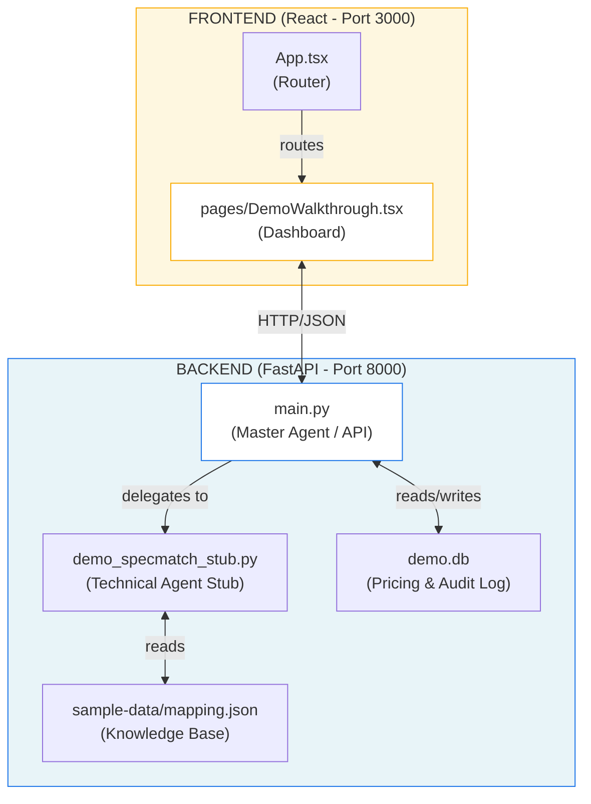

# Context: SpecMatch AI Hub

> This document provides 100% of the context needed to modify this codebase. Do NOT read source files unless making edits. All architecture, message protocols, storage schemas, and error patterns are documented below.

---

## 1. Project Identity
| Key | Value |
|-----|-------|
| **Name** | SpecMatch AI Hub |
| **Version** | 1.0.0 (Hackathon Presentation Release) |
| **Type** | Agentic AI Orchestration Platform (B2B SaaS) |
| **Goal** | Automate industrial RFP responses using specialized AI agents (Sales, Technical, Pricing) |

---

## 2. Core Philosophy & Architecture

The solution replaces slow, manual waterfall workflows with a **Master Agent** coordinating multiple specialized AI agents.

### High-Level Architecture (The "Vision")
1.  **Master Agent (Orchestration)**: Coordinates Sales, Technical, and Pricing agents using LangGraph state (Simulated in Demo).
2.  **Sales Agent (Discovery)**: Scans portals and alerts on high-value RFPs (Simulated via `upload_tender`).
3.  **Technical Agent (Hybrid SpecMatch)**: 
    *   **Semantic Retrieval**: GPT-4o + SBERT (Simulated).
    *   **Deterministic Rules**: Hard constraints (Implemented in `demo_specmatch_stub.py`).
4.  **Pricing Agent (Commercial)**: Maps SKUs to PostgreSQL cost tables (Implemented via SQLite in Demo).

### High-Level Agentic Architecture
```mermaid
graph TD
    User((User/Sales)) -->|Uploads RFP| Master[Master Agent<br/>(LangGraph Orchestrator)]
    Master -->|Delegates| Sales[Sales Agent<br/>(Tender Discovery)]
    Master -->|Delegates| Tech[Technical Agent<br/>(Hybrid SpecMatch)]
    Master -->|Delegates| Price[Pricing Agent<br/>(Commercial Logic)]
    
    Tech -->|Semantic Search| VectorDB[(Vector DB)]
    Tech -->|Rules| RulesEngine{Deterministic Engine}
    
    Price -->|Lookup| SQL[(PostgreSQL/Pricing)]
    
    Tech -->|Low Confidence| Human((Engineer))
    Human -->|Validate| Tech
    
    Price -->|Draft| Commercial((Comm. Team))
    Commercial -->|Approve| Master
    
    Master -->|Final Output| Proposal[PDF Proposal]
```

### Demo Implementation Map
| Architecture Component | Demo Equivalent (Codebase) |
|------------------------|---------------------------|
| **Master Agent** | `backend/main.py` (API Gateway & State Manager) |
| **Technical Agent** | `backend/demo_specmatch_stub.py` |
| **Knowledge Base** | `backend/sample-data/specmatch-mapping.json` (Mock Vector DB) |
| **Pricing DB** | `backend/demo.db` (SQLite) & `backend/sql/seed_pricing.sql` |
| **Sales Dashboard** | `frontend/src/pages/DemoWalkthrough.tsx` |

---

## 3. End-to-End Demo Flow (Alignment with Enterprise Plan)


### 1. Document Ingestion (Plan Sections 1-3)
*   **Enterprise Goal**: Automated portal scanning and PDF parsing.
*   **Demo Simulation**: User manually triggers the "Sales Agent" by uploading the **Professional RFP PDF** (`sample-tender.pdf`).
*   **Code**: `POST /tenders/upload` calls `DemoSpecMatchStub.process_pdf`.

### 2. Hybrid SpecMatch Engine (Plan Sections 4-5)
*   **Enterprise Goal**: Semantic Embedding + Deterministic Rules.
*   **Demo Simulation**: The **Stub** (`backend/demo_specmatch_stub.py`) acts as the Technical Agent. It uses a "Knowledge Base" (`specmatch-mapping.json`) to return mathematically precise matches (simulating GenAI) and hard-coded rules (simulating Deterministic Engine).
*   **Confidence Framework**: The system strictly implements the confidence logic (Green > 0.8, Yellow < 0.8) as requested in Section 4.3.

### 3. Orchestration & Human-in-the-Loop (Plan Sections 6-8)
*   **Enterprise Goal**: Workflow states (Discovered -> Validated -> Pricing).
*   **Demo Simulation**: The Frontend Dashboard moves the `Task` through these exact states.
*   **User Exp**: The "Reviewer View" (Section 8.2) is the main UI where engineers validate low-confidence items.

### 4. Output & Audit (Plan Sections 9-13)
*   **Enterprise Goal**: Traceability logs and Client-ready PDF.
*   **Demo Simulation**: The backend generates a timestamped Audit Log (stored in SQLite) and physically creates a downloadable proposal file in `demo-output/` containing the exact line items and pricing logic.

---

## 4. File Structure & Responsibilities



### Key Files
*   **`backend/main.py`**: The entry point. Handles the "Master Agent" coordination logic.
*   **`backend/demo_specmatch_stub.py`**: The "Brain" of the demo. Deterministically simulates complex AI matching logic using `specmatch-mapping.json`.
*   **`backend/db_utils.py`**: Handles SQLite interactions for persistent audit logs and pricing lookups.

---

## 5. Critical Constants & Configuration

### `backend/demo_specmatch_stub.py`
```python
# Simulated delay to make the demo feel realistic (Network/Processing lag)
time.sleep(1.5) 

# Threshold for "green" vs "yellow" confidence in Frontend UI
CONFIDENCE_THRESHOLD = 0.8
```

### Environment Variables (.env)
*   `DEMO_MODE=true`: Forces backend to use Stubs instead of real LLM calls.
*   `DATABASE_URL`: (Optional) Can override default SQLite `demo.db` with Postgres.

---

---

## 6. Project Directory Structure

```markdown
specmatch-ai-hub/
├── CONTEXT.md                  # Project Architecture, Philosophy, and Compliance Map
├── README.md                   # Quick Start Guide
├── demo-instructions.md        # Step-by-step Demo Script for Judges
├── run_all.sh                  # Execution Script (Starts Backend + Frontend)
├── docker-compose.yml          # Container Orchestration (Services: backend, frontend)
├── backend/                    # [Master Agent] Logic & State Management
│   ├── Dockerfile
│   ├── main.py                 # Master Agent / API Gateway (FastAPI)
│   ├── demo_specmatch_stub.py  # [Technical Agent] Hybrid Engine Simulation (Stub)
│   ├── db_utils.py             # [Pricing Agent] SQLite Database Helper
│   ├── requirements.txt
│   ├── demo-output/            # Generated Proposal Artifacts
│   │   └── demo.gif            # Demo recording/preview
│   ├── sample-data/            # [Knowledge Base]
│   │   ├── specmatch-mapping.json # Deterministic "Vector DB" for matching
│   │   ├── sample-tender.pdf   # Professional RFP Sample
│   │   └── generate_sample_pdf.py # Script to regenerate the sample PDF
│   ├── sql/
│   │   └── seed_pricing.sql    # Pricing Reference Data
│   └── tests/
│       └── test_backend.py     # End-to-End Flow Validation
├── frontend/                   # [Sales Dashboard] React + Vite UI
│   ├── Dockerfile
│   ├── src/
│   │   ├── App.tsx             # Main Router
│   │   ├── main.tsx
│   │   ├── pages/
│   │   │   ├── DemoWalkthrough.tsx # [Critical] Main Demo UI (Upload -> Validate -> Price)
│   │   │   ├── Dashboard.tsx
│   │   │   └── Login.tsx
│   │   ├── components/
│   │   │   ├── common/         # Shared UI components
│   │   │   └── ui/             # Shadcn/UI primitive components
│   │   ├── hooks/              # Custom React Hooks
│   │   └── lib/                # Utilities
│   ├── public/
│   └── ... (Config files: package.json, vite.config.ts, etc.)
```

---

## 7. Testing & Verification

### Backend Tests (Pytest)
```bash
cd backend
pytest
```
*   **`test_end_to_end_demo_flow`**: Runs the full lifecycle: Upload -> Match -> Validate -> Price -> file export.

---
