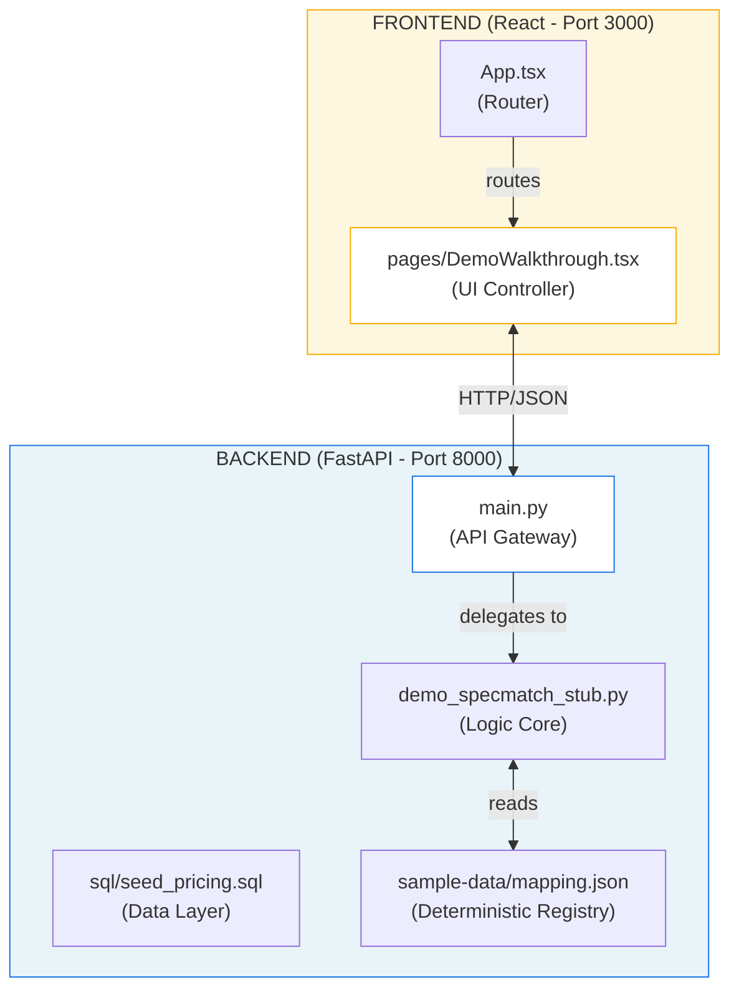

# Context: SpecMatch AI Hub

> This document provides 100% of the context needed to modify this codebase. Do NOT read source files unless making edits. All architecture, message protocols, storage schemas, and error patterns are documented below.

---

## 1. Project Identity
| Key | Value |
|-----|-------|
| **Name** | SpecMatch AI Hub |
| **Version** | 1.0.0 (Hackathon Presentation Release) |
| **Type** | Agentic AI Orchestration Platform (B2B SaaS) |
| **Goal** | Automate industrial RFP responses using specialized AI agents (Sales, Technical, Pricing) |

---

## 2. Core Philosophy: "Parallelization + Auditability"

### Parallelization (The "24-Hour" Goal)
| Mechanism | Value | Purpose |
|-----------|-------|---------|
| Multi-Agent Orchestration | Parallel Execution | Replace waterfall handoffs with concurrent Sales/Technical/Pricing work |
| Hybrid SpecMatch | Semantic + Deterministic | 80% reduction in technical validation time |
| Instant-Pricing | SQL-backed | Zero wait time for standard SKU costing |

### Auditability (The "Trust" Goal)
| Mechanism | Implementation | Purpose |
|-----------|----------------|---------|
| Event Logs | Timestamped Audit Trail | Every decision (SKU match, price change) is recorded |
| Human-in-the-Loop | Confidence Thresholds | Low-confidence matches (<80%) strictly require engineer validation |
| Deterministic Stubs | Fixed Logic (Demo Mode) | Ensures reproducible, crash-free presentations |

---

## 3. Architecture & File Roles



### File Responsibilities

| File | Role | Key Exports/Functions |
|------|------|----------------------|
| `backend/main.py` | API Gateway & State | `upload_tender`, `validate_match`, `generate_proposal` |
| `backend/demo_specmatch_stub.py` | Core Logic (Stubbed) | `process_pdf(path)` - Returns deterministic matches |
| `backend/sample-data/specmatch-mapping.json` | Truth Source | Maps filename `industrial-pump-rfp.pdf` to specific SKUs |
| `frontend/src/pages/DemoWalkthrough.tsx` | Demo Controller | Handles Upload → Validate → Pricing UI flow |
| `run_all.sh` | Orchestrator | Starts Backend (8000) and Frontend (3000) concurrently |

---

## 4. API & Data Flow

### 1. Tender Discovery & Upload
*   **Trigger**: User uploads PDF via `POST /tenders/upload`.
*   **Backend Action**: 
    1.  Receives file.
    2.  `DemoSpecMatchStub` checks filename against `mapping.json`.
    3.  If match found: Returns pre-computed SKUs with confidence scores.
    4.  If unknown: Returns generic fallback results.
*   **Response**: `{ task_id, status, matches: [...] }`

### 2. Technical Validation
*   **Trigger**: User clicks "Validate" on low-confidence item (`POST /tasks/{id}/validate`).
*   **Backend Action**: Updates in-memory state for specific match index.
*   **Frontend**: UI updates optimistically to show "✓ Engineer Approved".

### 3. Pricing & Proposal
*   **Trigger**: User clicks "Generate Proposal" (`POST /tasks/{id}/generate-proposal`).
*   **Payload**: `{ margin_percent: 15 }`
*   **Backend Action**:
    1.  Calculates `Base Cost + Margin` for all validated items.
    2.  Generates mock download URL.
*   **Response**: `{ total_value, download_url }`

---

## 5. Critical Constants

### `backend/demo_specmatch_stub.py`
```python
# Simulated delay to make the demo feel realistic
time.sleep(1.5) 

# Threshold for "green" vs "yellow" confidence in Frontend
CONFIDENCE_THRESHOLD = 0.8
```

---

## 6. Project Structure

```markdown
specmatch-ai-hub/
├── .github/workflows/          # CI Pipelines
├── backend/                    # Python FastAPI Backend
│   ├── sample-data/            # JSON Mappings for deterministic output
│   │   └── specmatch-mapping.json
│   ├── sql/                    # SQL Seeds for Pricing DB
│   ├── tests/                  # Pytest validation
│   ├── demo_specmatch_stub.py  # Critical: Demo logic implementation
│   ├── main.py                 # FastAPI Entrypoint
│   └── Dockerfile              # Python environment
├── frontend/                   # React Vite Frontend
│   ├── src/
│   │   ├── pages/
│   │   │   └── DemoWalkthrough.tsx # Main Demo UI (End-to-End Flow)
│   │   └── App.tsx             # Routing
│   └── Dockerfile              # Nginx environment
├── CONTEXT.md                  # This file (Architecture & Deep Dive)
├── README.md                   # Quick Start Guide
└── run_all.sh                  # Execution Script (Backend + Frontend)
```

---

## 7. Debugging Tips

| Issue | Check |
|-------|-------|
| Upload fails | Ensure backend is running (`ps -ef \| grep uvicorn`). Check `run_all.sh` logs. |
| "Generic Detected Item" appears | You uploaded a file NOT in `specmatch-mapping.json`. Use `industrial-pump-rfp.pdf`. |
| Frontend connection error | Verify `VITE_API_URL` is set to `http://localhost:8000`. |

---

## 8. Testing

### Backend Tests (Pytest)
```bash
cd backend
pytest
```
*   **`test_upload_flow`**: Verifies that uploading a PDF returns a valid Task ID and JSON structure.
*   **`test_health`**: Confirms server is runnable and in `DEMO_MODE`.

---
